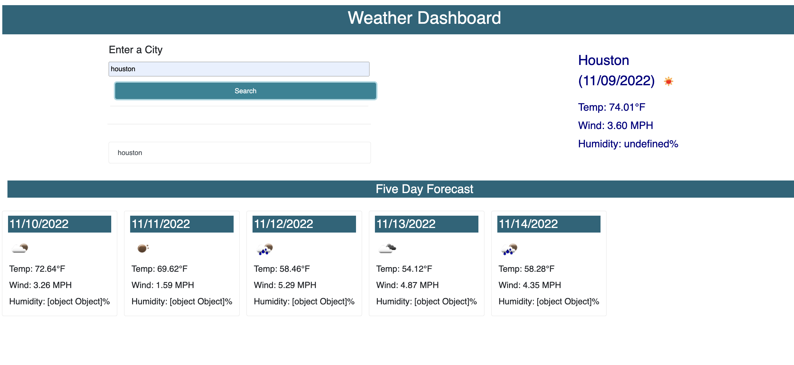

# Weather-Dashboard-Server-Side-API
Challenge 6

## Description
The goal of this challenge was to build a weather dashboard that will run in the browser and feature dynamically updated HTML and CSS. This application currently allows you to search for the weather in a particular city and see the temperature for the current day and five-day forecast. 

## Usage 
 

## Credits
I found several YouTube tutorials using the Open Weather API:  
[JavaScript Weather App Tutorial using Openweathermap API for beginners](https://www.youtube.com/watch?v=GXrDEA3SIOQ) 
[Build a Weather App with HTML, CSS & JavaScript](https://www.youtube.com/watch?v=WZNG8UomjSI) 
[OpenWeatherMap API Tutorial 2021](https://www.youtube.com/watch?v=nGVoHEZojiQ&t=1243s) 